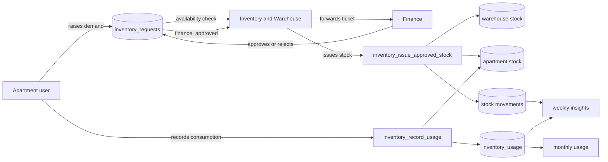
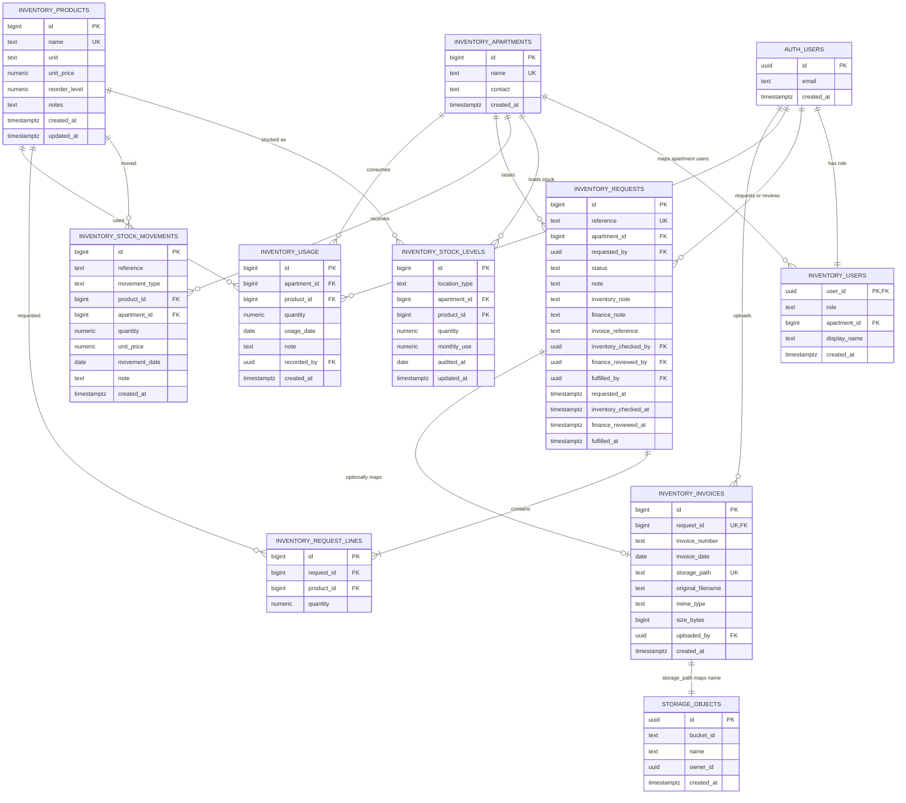
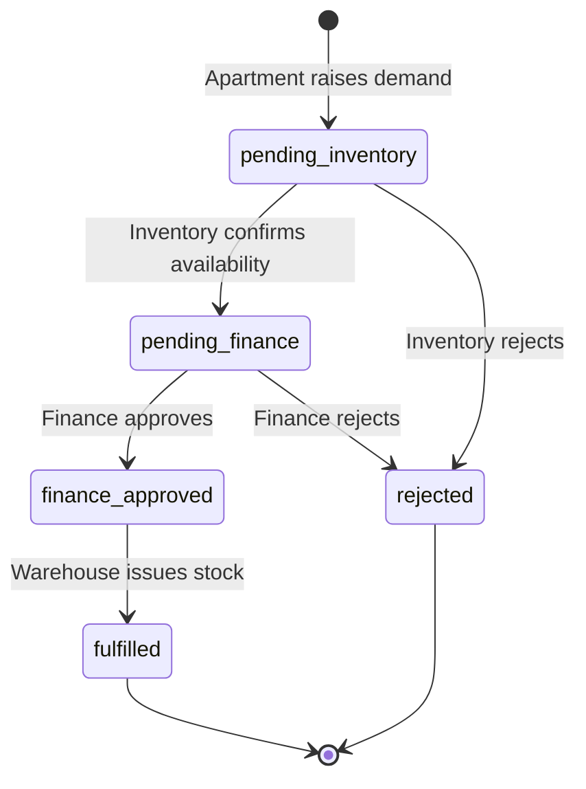
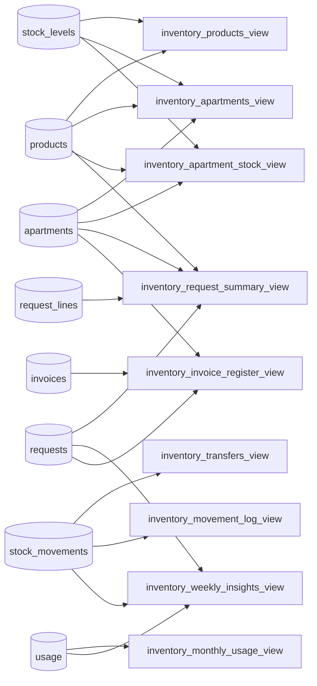
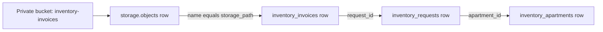

# KEPR Inventory Database Map

Last updated: 24 July 2026  
Supabase project: `yyjauhgdqywysyzerdll`

This document maps the PostgreSQL schema, Supabase Auth identities, Storage
bucket, reporting views, RPC functions, request lifecycle and role access used
by KEPR Inventory.

## System overview



## Entity relationship diagram



## Stock model

`inventory_stock_levels` stores both warehouse and apartment balances.

| `location_type` | `apartment_id` | Meaning |
|---|---:|---|
| `warehouse` | `NULL` | Main warehouse balance |
| `apartment` | Apartment ID | Balance currently issued to that apartment |

The unique constraint uses:

```text
(location_type, apartment_id, product_id) NULLS NOT DISTINCT
```

This guarantees one warehouse row per product and one row per
apartment/product pair.

Quantities move through locked PostgreSQL functions. The application must not
calculate or update both sides of a transfer independently.

## Demand lifecycle



### Transaction boundary

Stock does **not** move when:

- an apartment creates a request;
- Inventory forwards it to Finance;
- Finance approves it.

Stock moves only when Inventory calls:

```text
inventory_issue_approved_stock(request_id)
```

That function locks the ticket and warehouse rows, validates every line,
deducts warehouse quantities, upserts apartment quantities, writes immutable
movement rows and marks the request `fulfilled` in one transaction.

## Role mapping

`inventory_users.role` supports:

| Role | Apartment mapping | Primary responsibility |
|---|---|---|
| `inventory_admin` | Must be `NULL` | Catalogue, warehouse, availability, fulfillment |
| `finance_admin` | Must be `NULL` | Ticket approval or rejection |
| `apartment` | Required | Own stock, demand and usage |

Authentication identity comes from `auth.users`. Application authorization
comes from `inventory_users`.

## RPC/function map

```mermaid
flowchart TB
    SaveProduct[inventory_save_product] --> Products[(inventory_products)]
    SaveProduct --> Stock[(inventory_stock_levels)]

    Receive[inventory_receive_stock] --> Stock
    Receive --> Movements[(inventory_stock_movements)]

    CreateRequest[inventory_create_request] --> Requests[(inventory_requests)]
    CreateRequest --> Lines[(inventory_request_lines)]

    Check[inventory_check_request] --> Requests
    Check --> Stock

    FinanceReview[inventory_finance_review] --> Requests

    Issue[inventory_issue_approved_stock] --> Requests
    Issue --> Stock
    Issue --> Movements

    RecordUsage[inventory_record_usage] --> Stock
    RecordUsage --> Usage[(inventory_usage)]

    IsAdmin[inventory_is_admin] --> Users[(inventory_users)]
    IsFinance[inventory_is_finance] --> Users
```



| Function | Intended caller | Writes |
|---|---|---|
| `inventory_save_product` | Inventory | Product and warehouse stock |
| `inventory_receive_stock` | Inventory | Warehouse stock and receipt movement |
| `inventory_create_request` | Apartment | Request and request lines |
| `inventory_check_request` | Inventory | Request status/check metadata |
| `inventory_finance_review` | Finance | Request finance status/metadata |
| `inventory_issue_approved_stock` | Inventory | Both stock balances, movement log, request |
| `inventory_record_usage` | Apartment | Apartment balance and usage |
| `inventory_is_admin` | RLS/functions | Boolean role check |
| `inventory_is_finance` | RLS/functions | Boolean role check |

### Legacy functions still present

The migrations also define older functions retained for compatibility:

- `inventory_transfer_stock`
- `inventory_review_request`
- overloaded `inventory_fulfill_request`

The Flutter application does not use these in the current staged workflow.
Before a strict production security review, revoke or drop unused legacy RPCs
so the approved workflow is the only callable stock path.

## Reporting view map



| View | Purpose |
|---|---|
| `inventory_products_view` | Products with live warehouse quantity |
| `inventory_apartments_view` | Apartment item count and stock value |
| `inventory_apartment_stock_view` | Product-level apartment balances |
| `inventory_transfers_view` | Grouped transfer history |
| `inventory_movement_log_view` | Unified receipt/transfer audit log |
| `inventory_request_summary_view` | Ticket totals and approval state |
| `inventory_monthly_usage_view` | Monthly consumption by apartment/product |
| `inventory_weekly_insights_view` | Seven-day warehouse/apartment metrics |
| `inventory_invoice_register_view` | Searchable invoice metadata |

## Supabase Storage map



Bucket configuration:

| Property | Value |
|---|---|
| Bucket ID | `inventory-invoices` |
| Public | `false` |
| Maximum size | 10 MB |
| MIME types | PDF, JPEG, PNG, WebP |

Invoice files are optional in the current UI fulfillment path. The invoice
schema and register remain available for future bill attachment workflows.

## RLS/access summary

| Resource | Inventory | Finance | Apartment |
|---|---:|---:|---:|
| Own `inventory_users` profile | Read | Read | Read |
| Products/catalogue views | Read/write through app policies/RPC | Read | Read |
| Warehouse stock | Read/write through approved operations | Read | Read availability |
| Own apartment stock | Read | Read | Read mapped apartment |
| Requests | All workflow tickets | Finance-stage tickets | Own apartment |
| Request lines | Through visible request | Through visible request | Own request |
| Usage | All apartments | Reporting only if granted | Own apartment |
| Invoice metadata/files | Read/upload/delete | Read | Own request files |

The temporary anonymous policies from migration `17000` are removed by
migration `19000`. Current application access requires authenticated users.

## Indexes and integrity

Important constraints and indexes:

- Case-insensitive unique product name.
- Case-insensitive unique apartment name.
- Unique stock row by location/apartment/product.
- Non-negative stock, price, reorder and usage quantities.
- Positive movement, request-line and consumption quantities.
- Unique request reference.
- Unique product per request.
- One optional invoice per request.
- Unique invoice storage path.
- Movement reference and date indexes.
- Apartment/date usage index.
- Invoice date index.
- Foreign keys restrict deletion of referenced products and movements.

## Migration order

```text
20260723150000_inventory_schema.sql
20260723160000_fix_stock_levels_conflict.sql
20260723170000_temporary_anon_inventory_access.sql
20260723180000_stock_receipts_and_movement_log.sql
20260723190000_roles_requests_approvals_usage.sql
20260723200000_finance_approval_and_weekly_insights.sql
20260723210000_private_invoice_storage.sql
20260723220000_repair_invoice_bucket.sql
20260723230000_issue_stock_without_invoice.sql
```

After migrations, create Auth users and run:

```text
supabase/setup_demo_roles.sql
```

## Operational verification queries

### Users and roles

```sql
select au.email,iu.role,iu.display_name,a.name apartment
from public.inventory_users iu
join auth.users au on au.id=iu.user_id
left join public.inventory_apartments a on a.id=iu.apartment_id
order by au.email;
```

### Stock by location

```sql
select s.location_type,a.name apartment,p.name product,
  s.quantity,p.unit,s.updated_at
from public.inventory_stock_levels s
join public.inventory_products p on p.id=s.product_id
left join public.inventory_apartments a on a.id=s.apartment_id
order by s.location_type,a.name,p.name;
```

### Demand pipeline

```sql
select reference,apartment,status,line_count,total_quantity,total_value,
  requested_at,inventory_checked_at,finance_reviewed_at,fulfilled_at
from public.inventory_request_summary_view
order by id desc;
```

### Recent stock audit

```sql
select *
from public.inventory_movement_log_view
order by sort_id desc
limit 100;
```

### Invoice bucket

```sql
select id,name,public,file_size_limit,allowed_mime_types
from storage.buckets
where id='inventory-invoices';
```

